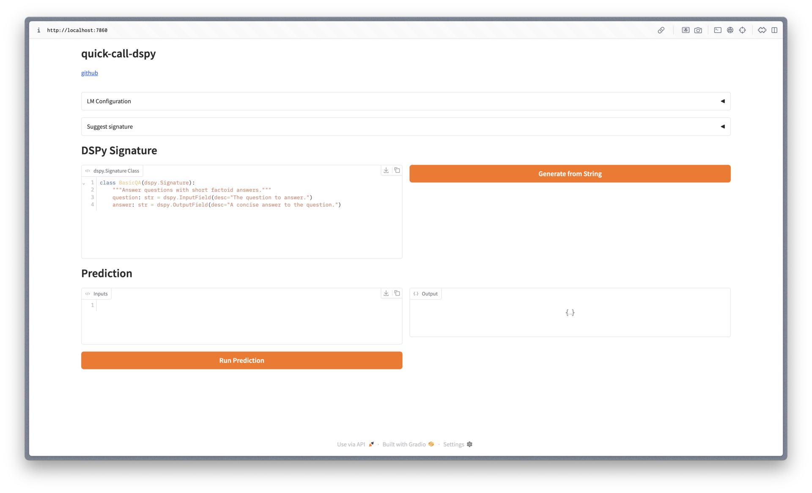

# quick-call-dspy

A just simple UI ([gradio](https://github.com/gradio-app/gradio)) to explain product manager what your prompt ([DSPy](https://github.com/stanfordnlp/dspy)) does and it is also super effective with students.



## Getting Started

1. Clone the repository:
```bash
git clone https://github.com/williambrach/quick-call-dspy.git
cd quick-call-dspy
```
2. Install the required dependencies:
```bash
uv venv --python 3.12.10
uv sync
source .venv/bin/activate
```

3. Optional - setup .env and add your credentials or insert your credentials via the UI:
```bash
cp .env.example .env
```

4. Run the application:
```bash
gradio app.py
```

5. Open the local URL (http://127.0.0.1:7860) in your browser and enjoy!

### Docker usage

```bash
docker-compose up --build
```

## Signaturize docs

### from_prompt

```python
def from_prompt(prompt: str, return_type: str = "signature") -> type | str:
```
- supported return types: "signature", "string"

This functionality is build upon the code from 
[vibe-dspy](https://github.com/Archelunch/vibe-dspy) repository. Please check it out for more details and add ⭐️.

### from_dspy_string

```python
def from_dspy_string(cls_string: str) -> type[dspy.Signature]:
```
- cls_string: A string representation of a DSPy signature class.
